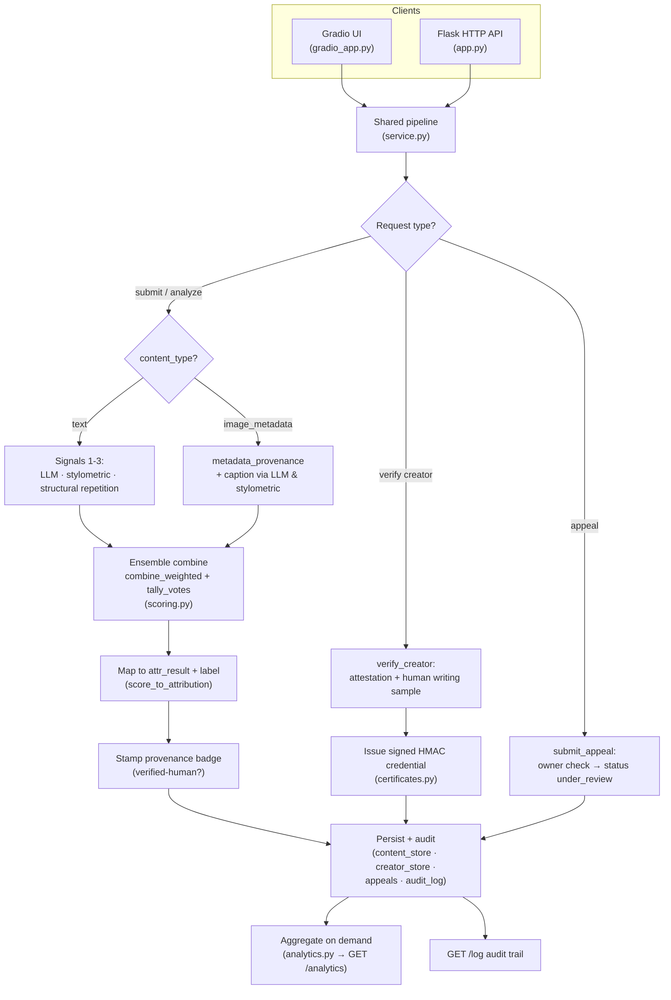

# Provenance Guard

Backend service for creative-sharing platforms that analyzes submitted content and returns a transparency label: human-written, AI-generated, or uncertain. Design reasoning is in `planning.md`; this covers what got built, why, and where implementation diverged from the plan.

The verdict is an **ensemble** of three independent detection signals combined with documented weights and a transparency vote. Creators can earn a signed **"verified human" credential**, submissions can be **text or image metadata** (two content modalities), an **analytics view** reports detection patterns and appeal rates, and an interactive **Gradio UI** (`gradio_app.py`) drives all of it over the same pipeline the HTTP API uses. See [Project 4 additions](#project-4-additions).

## Running it

```bash
pip install -r requirements.txt          # Flask + groq + gradio + pandas
# set GROQ_API_KEY in .env (needed for the LLM signal)
python app.py                            # HTTP API on :5000
python gradio_app.py                     # interactive UI on :7860
```

Both front-ends import the shared pipeline in `service.py`, so a verdict is identical whichever you use.

## Walkthrough

A recorded video walkthrough of the running system — submitting text and image-metadata content, earning the verified-human credential, filing an appeal, and reading the analytics dashboard — is in the project repository: [Morenayd/ai201-project4-provenance-guard](https://github.com/Morenayd/ai201-project4-provenance-guard).

## Architecture overview




**Submission path** (`POST /provenance/content/submit`, body: `creator_id`, plus `text` or `content_type: "image_metadata"` + `metadata`):

1. Validate `creator_id` and the modality-specific payload (400 if not). Core logic lives in `service.submit`, shared with the UI.
2. Generate a `content_id` (UUID).
3. Run the signal ensemble for the modality (three signals for text; metadata + caption-derived text signals for image metadata — see [Multi-modal support](#multi-modal-support)).
4. Combine the signal scores with documented weights (`combine_weighted`) and compute a transparency vote tally (`tally_votes`).
5. Map the weighted score to an `attr_result` and label using the five threshold bands (`score_to_attribution`).
6. Stamp the creator's provenance badge (verified-human or not) onto the result.
7. Persist the submission (`content_id`, `creator_id`, content, `content_type`, classification, vote/agreement detail, status `classified`) to the content store.
8. Write a structured `content_submitted` audit event (in memory and `audit.log` on disk).
9. Return `{content_id, content_type, attr_result, score, label, vote, provenance_badge}` to the client.

**Appeal path** (`POST /provenance/content/appeal`, body: `content_id`, `creator_id`, `creator_reasoning`):

1. Validate all three fields are present.
2. Look up the original submission by `content_id` (404 if not found).
3. Verify `creator_id` matches the original submitter (403 if not: prevents appealing someone else's content).
4. Create the appeal record, flip content status to `under_review`.
5. Write an `appeal_submitted` audit event that includes the original classification, so a reviewer has context without a second lookup.
6. Return `{status: "under_review", message: "Appeal recorded successfully."}`.

`GET /log` serves the full audit trail (both event types), with an `appealed` flag computed live against current content status rather than baked into old entries.

No storage is backed by a real database yet. Everything lives in in-memory stores (`content_store.py`, `appeals.py`, `audit_log.py`, `creator_store.py`), mirrored to `audit.log` on disk. Covered in Known Limitations.

### Endpoints

| Method & path | Purpose | Added |
|---|---|---|
| `POST /provenance/content/submit` | Analyze text or image metadata, return label + vote + badge | rate-limited; extended in Project 4 |
| `POST /provenance/creator/verify` | Earn the verified-human credential | Project 4 |
| `POST /provenance/creator/certificate/verify` | Validate a presented provenance certificate | Project 4 |
| `POST /provenance/content/appeal` | Contest a classification (owner only) | original |
| `GET /analytics` | Detection patterns, appeal rate, signal-agreement rate | Project 4 |
| `GET /log` | Full structured audit trail | original |

## Detection signals

Three signals now (Project 4 grew it from two — see [Ensemble detection](#ensemble-detection)). The original plan split work into four heuristic categories: structural over-optimization, unnatural phrasing, repetition, filler. See Spec Reflection for why I first collapsed them to two, then re-expanded to three genuinely distinct signals.

### Signal 1: LLM-based classification (Groq)

**What it measures:** holistic judgment. Sends text to `llama-3.3-70b-versatile`, asks it to assess semantic coherence, voice, and tells that are hard to reduce to a formula. Returns a 0-1 score plus a one-sentence reasoning string.

**Why I chose it:** strongest signal I have, by a wide margin. In every paired test during the build, it correctly called clearly-human text (casual, personal, imperfect) and clearly-AI text (formulaic, buzzword-heavy), including an AI essay ("paradigm shift... it is important to note... stakeholders") that initially fooled the stylometric signal.

**What it misses:** clean, well-edited AI text without surface tells. Test example: a paragraph on monetary policy and asset-price inflation got verdict `"uncertain"` at 0.4, reasoning "could suggest either a meticulous human author or an AI model trained on similar texts." The combined score inherits that uncertainty. Also a paid external call per submission: cost, latency, a failure mode handled as a 502, not a silent fallback.

### Signal 2: stylometric heuristics (pure Python)

**What it measures:** five sub-statistics, no external call required:

- **Sentence length variance**: AI text tends toward uniform sentence lengths, human writing is more erratic.
- **Type-token ratio** (vocabulary diversity): low diversity reads as more repetitive, more AI-like.
- **Punctuation density**: punctuation marks per word.
- **Average sentence complexity**: mean words per sentence.
- **Cliché/buzzword phrase density**: fixed lexicon of phrases common in LLM output ("it is important to note," "paradigm shift," "delve into," "leverage"). Added after the first four missed a text using generic AI phrasing with genuinely varied vocabulary.

**Why I chose it:** fast, free, deterministic, no dependency on Groq. Encodes a testable hypothesis directly: AI is more uniform, human is more variable.

**What it misses:** narrower range than the LLM. Same test pairs, LLM swings 0.1 to 0.9; stylometric score, even after amplifying with `STRETCH_FACTOR`, swings roughly 0.2 to 0.6. Cannot dominate the combined average. Weak on short text: sentence-length variance is undefined for a single sentence, type-token ratio reads almost always "human" on short samples regardless of author, since words rarely repeat in one or two sentences. Both omitted from the average below a length threshold instead of diluting the result. The cliché lexicon only catches phrasing on its list; AI text avoiding those phrases gets nothing from that sub-metric.

## Confidence scoring

The live path now uses `combine_weighted()`: a **documented weighted average** of the signal scores (see [Ensemble detection](#ensemble-detection) for the weights and rationale), rounded to 4 decimal places, renormalized over whichever signals actually ran. `score_to_attribution()` then maps the result to one of five `(attr_result, label)` pairs. The old plain-average `combine_scores()` is kept for backward compatibility; the two paired examples below predate the weighted ensemble and reflect the original equal-average numbers.

**Validation:** repeated testing against paired human/AI samples (casual reviews, poetry, formulaic essays, academic prose), checking the score moved the right direction after each change. Caught real bugs this way: a punctuation-density redesign that sounded justified in isolation flipped a clearly-human sample to score more AI-like than an actual AI sample. Only re-testing against fixed examples caught it.

**Two example submissions, verified live against the current code:**

High confidence (human):
> "ok so i finally tried that new ramen place downtown and honestly? underwhelming. the broth was fine but they put WAY too much sodium in it and i was thirsty for like three hours after. my friend got the spicy version and said it was better. probably wont go back unless someone drags me there"

- LLM: `0.2` (verdict: human, "informal language, personal opinions, and a conversational tone")
- Stylometric: `0.2413`
- **Combined score: `0.2207` → `highly_likely_human`**
- Label: "Highly likely human: This content appears to be mostly human-written."

Lower confidence:
> "The relationship between monetary policy and asset price inflation has been extensively studied in the literature. Central banks face a fundamental tension between their mandate for price stability and the unintended consequences of prolonged low interest rates on equity and real estate valuations."

- LLM: `0.4` (verdict: uncertain, "could suggest either a meticulous human author or an AI model")
- Stylometric: `0.4702`
- **Combined score: `0.4351` → `likely_human`**
- Label: "Likely human: This content appears to be human-written, possibly with light AI editing."

Both signals independently expressed low confidence in the second example. The combined score reflects that instead of averaging into a falsely confident answer. 0.4351 isn't wrong: it's the system reporting it doesn't know.

## Transparency label

Five variants, matching the five threshold bands exactly. Not collapsed to three.

| Score range | `attr_result` | Label text |
|---|---|---|
| 0.00-0.34 | `highly_likely_human` | "Highly likely human: This content appears to be mostly human-written." |
| 0.35-0.44 | `likely_human` | "Likely human: This content appears to be human-written, possibly with light AI editing." |
| 0.45-0.55 | `uncertain` | "Uncertain: This content may be human-written or AI-generated." |
| 0.56-0.70 | `likely_ai` | "Likely AI: This content appears to be AI-generated, possibly with light human editing." |
| 0.71-1.00 | `highly_likely_ai` | "Highly likely AI: This content appears to be mostly AI-generated." |

Why five, not three: "likely" and "highly likely" are different claims, not different confidence levels of the same claim. "Highly likely AI" means mostly AI-written. "Likely AI" means predominantly AI-written, possibly lightly edited by a human (symmetric for the human side). Collapsing them loses information the score expresses.

## Rate limiting

`POST /provenance/content/submit` is rate-limited per IP address with [Flask-Limiter](https://flask-limiter.readthedocs.io/), two limits enforced together:

- **3 requests per minute**: burst cap.
- **10 requests per hour**: sustained-usage cap.
- **100 requests per day**

**Reasoning for these numbers:**

- A person submitting their own writing reads, edits, and thinks between submissions. Testing two or three short pieces back to back doesn't approach one request every 20 seconds, so 3/minute is comfortable headroom. A script flooding the endpoint can fire many requests in under a second; the per-minute cap forces it down to a human pace before the hourly cap matters.
- 10/hour matches a realistic session: drafts, revisions, a handful of pieces. Generous enough for normal use and testing, while bounding load and Groq API cost per IP per hour. Matches the limit committed to in `planning.md`'s Rate Limiting Plan.
- Combined, the two limits close the gap either alone leaves open. 10/hour alone doesn't stop a 10-request burst in one second. A per-minute cap alone doesn't stop slow, sustained abuse spread across the day.

Exceeding either limit returns `429 Too Many Requests` with a JSON body, e.g. `{"error": "rate limit exceeded: 3 per 1 minute"}`.

Limits are per IP address (`flask_limiter.util.get_remote_address`); no account/auth layer yet. Limit state is stored in memory (`storage_uri="memory://"`), consistent with the rest of the prototype's in-memory stores. Resets on restart, not shared across processes. Acceptable pre-Milestone-1 (SQLite), should move to a shared backend (Redis) before multi-process deployment.

Only the submission endpoint is rate-limited. `/provenance/content/appeal` and `/log` are not: they don't make external API calls and aren't the abuse vector this limit addresses.

**Verified behavior**, 12 rapid requests from the same IP within one minute:

```
$ for i in $(seq 1 12); do
    curl -s -o /dev/null -w "%{http_code}\n" -X POST http://127.0.0.1:5000/provenance/content/submit \
      -H "Content-Type: application/json" \
      -d '{"text": "This is a test submission for rate limit testing purposes only.", "creator_id": "ratelimit-test"}'
  done
200
200
200
429
429
429
429
429
429
429
429
429
```

The first 3 succeed. Everything after is blocked for the rest of the minute. Confirmed separately that blocked (429) requests don't consume the 10-per-hour quota, only successful ones do.

## Audit logging

Every submission and appeal is logged ( `GET /log`) as JSON to `audit.log`. Each entry captures a timestamp (`created_at`), `content_id`, attribution result, combined confidence score, both individual signal scores, and whether an appeal has been filed.

Example, 3 entries from a real run (submit content A, submit content B, appeal content B):

```json
{
  "entries": [
    {
      "appealed": true,
      "content_id": "a700baa8-1911-4043-8375-1d5bbe8a522b",
      "created_at": "2026-06-30T23:44:51.143289+00:00",
      "event_id": "71fbe5e6-5b75-4308-9f91-c6e7ac40baec",
      "event_type": "appeal_submitted",
      "payload": {
        "appeal_id": "864c4776-80ff-4514-bf9f-7bb2dc016577",
        "appeal_reasoning": "This was written by me, not AI.",
        "creator_id": "creator-b",
        "original_attr_result": "likely_ai",
        "original_label": "Likely AI: This content appears to be AI-generated, possibly with light human editing.",
        "original_score": 0.6222,
        "status": "under_review"
      }
    },
    {
      "appealed": true,
      "content_id": "a700baa8-1911-4043-8375-1d5bbe8a522b",
      "created_at": "2026-06-30T23:44:51.063398+00:00",
      "event_id": "c67cf7f3-9d9c-45f4-9d1f-0363bc260065",
      "event_type": "content_submitted",
      "payload": {
        "attr_result": "likely_ai",
        "creator_id": "creator-b",
        "label": "Likely AI: This content appears to be AI-generated, possibly with light human editing.",
        "llm_classification_score": 0.7,
        "score": 0.6222,
        "signals_used": {
          "llm_classification": {
            "reasoning": "The text's overly formal and generic phrase structure, such as 'it is important to note', suggests a lack of personal touch and nuance typical of human writing.",
            "score": 0.7,
            "verdict": "ai"
          },
          "stylometric": {
            "cliche_phrase_score": 1.0,
            "punctuation_density_score": 0.16806722689075632,
            "score": 0.5444,
            "sentence_complexity_score": 0.68
          }
        },
        "stylometric_score": 0.5444
      }
    },
    {
      "appealed": false,
      "content_id": "4d78b22b-daf3-4a6c-807a-a3123adfb71e",
      "created_at": "2026-06-30T23:44:50.765606+00:00",
      "event_id": "dcb26744-4c6a-4c0e-9a51-5606ab9c6f32",
      "event_type": "content_submitted",
      "payload": {
        "attr_result": "likely_human",
        "creator_id": "creator-a",
        "label": "Likely human: This content appears to be human-written, possibly with light AI editing.",
        "llm_classification_score": 0.2,
        "score": 0.3565,
        "signals_used": {
          "llm_classification": {
            "reasoning": "The text features informal language, personal opinion, and a conversational tone, which are characteristic of human writing.",
            "score": 0.2,
            "verdict": "human"
          },
          "stylometric": {
            "punctuation_density_score": 0.3007518796992481,
            "score": 0.513,
            "sentence_complexity_score": 0.76
          }
        },
        "stylometric_score": 0.513
      }
    }
  ]
}
```

Content A, never appealed: `"appealed": false`. Content B: `"appealed": true` on both entries after being appealed.

## Project 4 additions

Four capabilities added on top of the original service, plus an interactive UI. All of them route through one shared pipeline (`service.py`) so the HTTP API and the Gradio UI can never disagree about a verdict.

### Ensemble detection

Three signals, combined with **documented weights** and a **majority-vote overlay** (`scoring.py`).

**Signal 3 — structural repetition (`structural_repetition_score`, pure Python).** Where the stylometric signal measures *within-sentence* surface stats (unigram vocabulary diversity, punctuation, complexity), this signal measures repetition of multi-word *structure* across the whole submission, which is genuinely different evidence:

- **bigram / trigram repetition**: fraction of two- and three-word sequences that recur. Templated AI text reuses short phrases even when individual word choices vary, so it can pass the unigram diversity check and still fail here.
- **sentence-opener repetition**: fraction of sentences that begin with an already-used opener ("Additionally,", "Moreover,", "The …").

It uses the same short-text policy as Signal 2: a sub-score is omitted when there isn't enough text to compute it, and the result is dampened toward neutral for short samples via the shared `RELIABLE_WORDS` ramp.

**Weighting (the decision).** `combine_weighted()` takes a weighted average, weights renormalized over the signals that actually ran:

| Signal | Weight | Why |
|---|---|---|
| `llm_classification` | 0.5 | Strongest signal by a wide margin in paired testing; holistic judgment the pure-Python signals can't replicate. |
| `stylometric` | 0.3 | Free and deterministic, but narrower range and weak on short/clean text — informs, shouldn't dominate. |
| `structural_repetition` | 0.2 | Newest and noisiest; catches templated repetition the others miss, but least reliable alone. |
| `metadata_provenance` | 0.6 | Image modality only: metadata tags are the most direct provenance evidence available, so it leads. |

**Voting (transparency overlay, not the decision).** `tally_votes()` has each signal cast a human/uncertain/ai vote from its own score band, then reports the tally, the majority, and an **agreement** fraction. A 0.6 where all signals say "ai" is a different situation from a 0.6 that splits the panel — the weighted number alone hides that; the vote surfaces it, and the agreement fraction feeds the analytics dashboard.

### Provenance certificate ("verified human")

A creator earns a **verified-human credential** through an explicit verification step (`POST /provenance/creator/verify`, or the UI's *Verify creator* tab): they submit a fresh writing sample (≥ 40 words) of their own unassisted writing and affirm an attestation. The step passes only if (1) the attestation is affirmed and (2) the detection ensemble does **not** read the sample as AI-generated (`score ≤ 0.55` — clear AI is rejected, while a genuinely uncertain reading of clean human writing is accepted so honest creators aren't gatekept out).

On success, `certificates.py` mints a credential: a small JSON payload (creator, method, issue time) signed with **HMAC-SHA256** over a server secret (`PROVENANCE_SECRET`). It's tamper-evident — altering any field invalidates the signature (`verify_certificate`), checked with a constant-time compare. `POST /provenance/creator/certificate/verify` validates a presented credential.

**Display.** A verified creator's submissions carry a `provenance_badge` in the API response and a "**✓ Verified Human Creator**" badge in the UI, rendered by `badge_for()` so the badge text and the credential stay in sync. Unverified creators get an explicit "Unverified creator" badge rather than nothing, so the absence of a credential is visible rather than ambiguous.

### Analytics dashboard

`GET /analytics` (and the UI's *Analytics* tab) aggregates the stores into four metric groups (`analytics.py`):

1. **Detection patterns** — submission counts across the five attribution bands and across the two content modalities.
2. **Appeal rate** — fraction of submissions appealed. A creator-friendly system watches this: a rising appeal rate is a signal the detector may be over-flagging.
3. **Signal-agreement rate** (the additional metric) — mean ensemble vote agreement across submissions. It measures how often the signals actually corroborated each other rather than a blended number papering over a split decision; low agreement means verdicts rest on internally-contested evidence.
4. **Confidence summary** — mean score and the verified-human footprint (verified creators, verified-submission share).

### Multi-modal support

Submissions carry a `content_type`: `text` (default) or `image_metadata`. Image-metadata submissions send a structured `metadata` object instead of prose, and get their own signal (`metadata_provenance_score`) that reads provenance straight out of the metadata:

- **AI-generator software tags** (`software: "Stable Diffusion"`, "Midjourney", "Firefly", …) → strong AI evidence.
- **Generation parameters** (`prompt`, `seed`, `cfg_scale`, `steps`, …) → prompt-driven synthesis.
- **Camera EXIF** (`Make`, `Model`, `ISO`, `FocalLength`, `DateTimeOriginal`, …) → counter-evidence of a real photograph; its total absence leans mildly AI.

If the metadata includes a `caption`, that free text is folded through the existing LLM and stylometric signals so the two modalities share machinery — and the caption's LLM call is **best-effort** for this modality (metadata alone is already a meaningful verdict), so a Groq outage degrades to metadata-only instead of failing the request. For text, the LLM signal remains primary and a failure still surfaces as a 502.

### Interactive interface (Gradio)

`gradio_app.py` is a thin UI over `service.py` with five tabs — **Analyze content** (text or image metadata, with the full signal/vote breakdown and badge), **Verify creator**, **Appeal**, **Analytics** (with a bar chart of detection patterns), and **Audit log**. Run `python gradio_app.py` and open `http://127.0.0.1:7860`.

## Known limitations

Dense, well-edited academic or expository prose is what I'd expect this system to misclassify most often. Real example, not hypothetical: the monetary-policy paragraph used above as the "lower confidence" example is AI-generated. It landed on `likely_human` (0.4351), wrong side of "uncertain." No surface AI tells: no repeated stock phrases, no unnaturally uniform sentence structure, no vocabulary that trips the cliché lexicon. The LLM signal admitted it couldn't confidently tell a careful human academic writer from a competent AI model without more context. Not a patchable bug: the LLM relies partly on stylistic tells that careful writing minimizes regardless of author, and the cliché-phrase check only catches phrasing on its list.

Two other known-weaker cases, both flagged in `planning.md`'s Anticipated Edge Cases and confirmed during testing: formulaic creative writing like poetry (short, unusual structure that can read as engineered or deliberate), and very short submissions, where the stylometric signal lacks enough text to compute several sub-scores and falls back toward neutral.

## Spec reflection

**Where the spec helped:** `planning.md`, written before any code, gave concrete signal definitions, exact threshold numbers, exact label text. Fixed reference point mid-build instead of re-deciding things from scratch. When I asked for the stylometric score to be "better," I could point at the actual threshold table instead of guessing what "better" meant. Same with "likely" vs "highly likely": decided and documented early, so a later label mismatch got corrected against my own stated intent instead of re-litigated.

**Where implementation diverged, and why:** the original Detection Signals section split work into four heuristic categories, structural over-optimization, unnatural phrase usage, repetition without purpose, filler phrasing, each implied as its own signal. Partway through, I decided that was four flavors of the same evidence (surface statistics), not four genuinely different signals, and it didn't serve my own goal of signals that capture genuinely different properties of the text. Redesigned down to two: one LLM judgment, one statistics-based judgment, folding the original four ideas in as sub-metrics of the second instead of separate top-level scores. Useful spec to build from, not sacred once it stopped satisfying its own design goal.

## AI usage section

1. **Widening the stylometric range.** Stylometric scores were clustering near the 0.5 boundary regardless of input. Told the AI to fix it. Its first attempt redefined punctuation density as cross-sentence uniformity instead of raw density, matching the "AI is more uniform" hypothesis. Sounded right. Re-testing against the same fixed human/AI pair showed it had flipped a clearly-human casual sample to score more AI-like than before: short casual sentences also have low punctuation variance, not an AI-specific trait. Had it revert that change, kept only a simpler score-amplification factor. Improved separation without breaking direction on any existing test case.

2. **Fixing the "clearly AI" essay scoring as human-leaning.** Told the AI the stylometric score was incredibly low for the clearly AI one, an essay full of "paradigm shift" and "it is important to note" with genuinely varied vocabulary. It diagnosed that type-token ratio only catches word-level repetition, not phrase-level formulaic patterns, and added a cliché-phrase lexicon as a new sub-metric. First version always included that sub-score in the average, even at zero matches, which dragged down the legitimately clean AI-generated monetary-policy sample for the wrong reason: absence of a tell isn't evidence of being human. Had it fold the cliché score in only when it finds a match, so it can push a score toward AI, never dilute one toward human by default.

3. **Apostrophe bug.** While extending single-sentence handling, the AI found, unprompted, during testing, that the punctuation-counting regex was double-counting apostrophes in contractions like "I'm," already counted by the word-tokenizing regex. Was inflating punctuation density for casual, contraction-heavy human writing in the wrong direction. Fixed once flagged.
