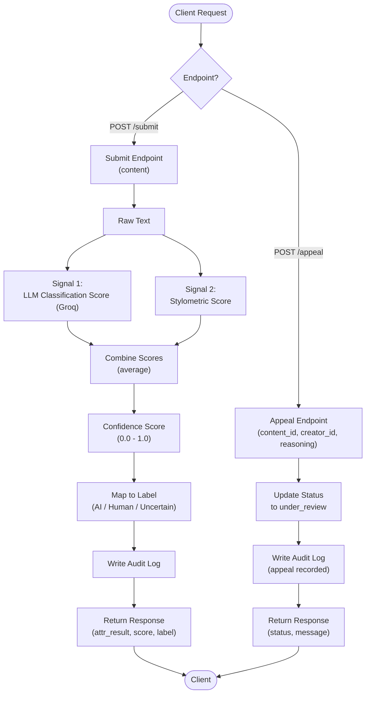

# Provenance Guard Planning

## Project Overview
I am building Provenance Guard as a backend service for creative-sharing platforms that can analyze submitted text and return a transparency label describing whether the content appears to be human-written or AI-generated. The goal is not to create a perfect detector, but to build a system that is useful, cautious, and fair to creators.

## Goals
I want the backend to be able to:
- accept content submissions for attribution analysis,
- combine multiple signals instead of relying on one weak heuristic,
- return a confidence score that reflects uncertainty rather than pretending the answer is certain,
- show a plain-language transparency label to end users,
- support appeals that move content into review,
- and maintain a structured audit trail.

## Detection Signals
I will use two signals that capture genuinely different properties of the text, not two versions of the same approach. Each signal will produce a score between 0 and 1, where 0 means strongly human-like and 1 means strongly AI-like. I will average the two signal scores into a single combined confidence score.

1. LLM-based classification (Groq)
   - Asks the model to assess holistically whether the text reads as human-written or AI-generated.
   - Captures semantic and stylistic coherence that is hard to reduce to a formula.
   - Output: a 0-1 score.

2. Stylometric heuristics
   - Computed in pure Python, with no external calls.
     - Structural over-optimization (consistent sentence length, tidy formatting that feels engineered) -> sentence length variance.
     - Unnatural phrase usage (generic, stiff, or formulaic wording) -> type-token ratio (vocabulary diversity).
     - Repetition without purpose (restating the same idea without adding meaning) -> also reflected in type-token ratio and sentence length variance.
     - Filler or empty phrasing (vague filler, weak transitions, low-information sentences) -> reflected in average sentence complexity and punctuation density.
   - Output: a 0-1 score.

I will combine the two scores by taking their average. That gives a single confidence score between 0 and 1 that reflects the overall evidence.

## Uncertainty Representation
A confidence score of 0.6 means the system sees moderate evidence that the content looks AI-generated, but not enough to make a high-confidence claim. In other words, 0.6 is a meaningful warning signal, not a hard verdict.

I will map the raw signal outputs to a calibrated score in this way:
- each signal outputs a score from 0.0 to 1.0,
- the two scores are averaged into a combined score,
- and that combined score is mapped to a label using the thresholds below.

Thresholds:
- 0.00 to 0.34: highly likely human — mostly written by a human.
- 0.35 to 0.44: likely human — likely human-written, but may have been lightly AI-edited.
- 0.45 to 0.55: uncertain — mixed evidence; could be either.
- 0.56 to 0.70: likely AI — likely AI-written, but may have been lightly edited by a human.
- 0.71 to 1.00: highly likely AI — mostly written by AI.

This is intentionally conservative. A score near 0.5 should not feel like a forced decision; it should signal that the evidence is mixed and the system should stay cautious. The "likely" bands are deliberately distinct from the "highly likely" bands: they represent content that is predominantly one or the other but may carry light editing from the opposite source, not just a weaker version of the same claim.

## Transparency Label Design
The label shown to readers will be simple and plain-language, and will match the five threshold bands from Uncertainty Representation exactly, since those band names were chosen deliberately.

- Highly likely human: "Highly likely human: This content appears to be mostly human-written."
- Likely human: "Likely human: This content appears to be human-written, possibly with light AI editing."
- Uncertain: "Uncertain: This content may be human-written or AI-generated."
- Likely AI: "Likely AI: This content appears to be AI-generated, possibly with light human editing."
- Highly likely AI: "Highly likely AI: This content appears to be mostly AI-generated."

These strings will be returned in the API response so the platform can render them directly.

## Example Submissions
These are the concrete samples I used while designing and testing the thresholds. I am recording them here so the intended behavior of each band is anchored to real text, not just abstract score ranges. The scores below are illustrative of where I expect each sample to land; the actual verified numbers are in the README.

### Example 1: clearly human (casual, personal)
> "ok so i finally tried that new ramen place downtown and honestly? underwhelming. the broth was fine but they put WAY too much sodium in it and i was thirsty for like three hours after. my friend got the spicy version and said it was better. probably wont go back unless someone drags me there"

Informal tone, personal opinion, uneven punctuation and capitalization. This is exactly the kind of text I expect to land firmly in **highly likely human** (a low combined score, well under 0.34). It is my anchor for "the system should be confident when the human tells are obvious."

### Example 2: AI text with surface tells
> An essay leaning on stock phrasing — "paradigm shift," "it is important to note," "stakeholders across the ecosystem" — while still using genuinely varied vocabulary.

This is the case that motivated the cliché/buzzword sub-metric. Vocabulary diversity alone (type-token ratio) reads it as human because the words rarely repeat, but it is built almost entirely out of formulaic phrases. I expect it to land in **likely AI / highly likely AI**, and it is my anchor for "surface statistics must catch phrase-level tells, not just word-level repetition."

### Example 3: AI text with no surface tells (the hard case)
> "The relationship between monetary policy and asset price inflation has been extensively studied in the literature. Central banks face a fundamental tension between their mandate for price stability and the unintended consequences of prolonged low interest rates on equity and real estate valuations."

This paragraph is AI-generated but reads like careful human academic writing: no repeated stock phrases, no unnaturally uniform structure, nothing that trips the cliché lexicon. I expect the system to be genuinely **uncertain** here (a combined score near the middle), and I accept that it may lean slightly toward "likely human." This is my anchor for the honest limit of the approach — see Anticipated Edge Cases — and the reason the scoring is deliberately conservative rather than forced toward a confident verdict.

## Appeals Workflow
Any creator who can be linked to a submission through creator_id can submit an appeal. The appeal must include:
- content_id,
- creator_id,
- and a short reasoning field explaining why the creator believes the classification is wrong.

When an appeal is received, the system will:
- create an appeal record,
- update the content status to under_review,
- append an audit-log entry describing the appeal and the status change,
- and return a success response.

A human reviewer would see a queue that includes the content_id, original classification, confidence score, label text, appeal reasoning, submission text, and current status. Automated reclassification is not required.

## Anticipated Edge Cases
I expect the system to handle some content poorly because the signals are heuristic rather than perfect.

Two specific scenarios I am planning for are:
- Formulaic creative writing like poetry.
- Extremely structured technical or educational documentation.

I will also expect weaker performance on very short submissions, since there is not enough text to make the signals reliable.

## API Contract
### Submission endpoint
I will expose a submission endpoint at /provenance/content/submit.

Request body:
```json
{
  "content": "A short poem or blog excerpt"
}
```

Response body:
```json
{
  "attr_result": "likely_ai",
  "score": 0.67,
  "label": "Likely AI: This content appears to be AI-generated, possibly with light human editing."
}
```

### Appeal endpoint
I will also expose an appeal endpoint at /provenance/content/appeal.

Request body:
```json
{
  "content_id": "123",
  "creator_id": "user-1",
  "reasoning": "This was written by me and should not have been flagged."
}
```

Response body:
```json
{
  "status": "under_review",
  "message": "Appeal recorded successfully."
}
```

## Architecture
The submission flow takes raw text into the signal analysis layer, combines the signal scores into a single confidence value, maps that score to a transparency label, writes an audit entry, and returns the result. The appeal flow takes a creator's reasoning, updates the content status to under_review, writes an audit entry for the appeal, and returns a response to the requester.



## Data Model
I will store content submissions, classification results, appeals, and audit events in SQLite.

### Content record
- content_id
- creator_id
- content_text
- submitted_at
- status

### Decision record
- content_id
- attr_result
- score
- label
- signals_used
- created_at

### Appeal record
- appeal_id
- content_id
- creator_id
- reasoning
- submitted_at
- status

### Audit log entry
- event_id
- content_id
- event_type
- payload
- created_at

## Rate Limiting Plan
I will enforce a rate limit on the submission endpoint so a single user cannot flood the system. I plan to allow 10 submissions per IP address per hour. That is reasonably generous for normal testing and everyday use while still making abuse more difficult.

## Audit Logging Plan
Every important event will be logged in a structured way. I want the audit trail to capture:
- when content is submitted,
- what signals were used,
- what score was produced,
- what label was returned,
- when an appeal is submitted,
- and when the content status changes to under review.

## AI Tool Plan
### M3: submission endpoint + first signal
I will give the AI tool the Detection Signals section and the Architecture section. I will ask it to generate:
- a Flask app skeleton,
- the first signal function: LLM-based classification using Groq,
- and the basic request/response structure for /provenance/content/submit.

I will verify the result by testing a few sample inputs directly before wiring the function into the endpoint.

### M4: second signal + confidence scoring
I will give the AI tool the Detection Signals section, the Uncertainty Representation section, and the Architecture section. I will ask it to generate:
- the second signal function: stylometric heuristics computed in pure Python,
- the combined scoring logic,
- and the mapping from score to attr_result and label.

I will check that the scores vary meaningfully between clearly AI-like and clearly human-like text.

### M5: production layer
I will give the AI tool the Transparency Label Design section, the Appeals Workflow section, and the Architecture section. I will ask it to generate:
- the label generation logic,
- the /provenance/content/appeal endpoint,
- and the status update and logging behavior.

I will verify that all five label variants are reachable and that submitting an appeal updates the content status correctly.

## Implementation Plan
### Milestone 1: Setup
I will create the Flask app structure, add dependencies, and set up the SQLite database.

### Milestone 2: Detection Pipeline
I will implement the signal checks, combine the scores, and map the result to a final label.

### Milestone 3: Appeals and Review State
I will add the appeal endpoint, update the content status to under review, and log the event.

### Milestone 4: Safety and Documentation
I will add rate limiting, make the audit log visible through /log, and write the README with the endpoint behavior, label text, scoring logic, and rate-limit details.

## Definition of Success
I will consider this project successful if it can:
- accept content and return a structured classification response,
- use multiple distinct signals,
- produce a meaningful confidence score,
- show a clear transparency label,
- support an appeal workflow,
- enforce rate limiting,
- and create a structured audit log with several entries.
